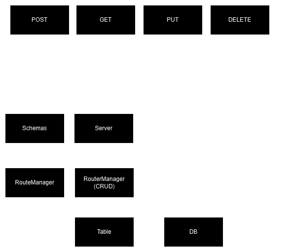

# Syntra Structure

## Common RESTful API Structure

The typical structure of a RESTful API, commonly used in frameworks like ASP.NET Core and Flask, looks like this:

### How it works

1. **Routers**: Define endpoints to handle incoming HTTP requests.
2. **Schemas**: Requests are validated and converted into schemas if needed.
3. **Services**: Once validated, the data is sent to a service layer that contains business logic.
4. **Models**: Services interact with models to process and manipulate data within a database

This flow ensures that routers handle routing, schemas validate data, services encapsulate business rules, and models
handle database operations.

This architecture shines when your application needs to handle dynamic requests or data that isn’t directly defined in a
database. It provides flexibility by allowing you to validate, transform, and process incoming data independently of
your database schema, making it ideal for complex APIs with varied data inputs.

However, this structure can introduce a significant amount of boilerplate code, especially for simple CRUD operations or
straightforward requests. The multiple layers (routers, schemas, services, models) might feel like overkill if your API
primarily deals with basic data retrieval or updates. For simpler use cases, a more streamlined approach may be more
efficient.

## Syntra Structure

The Syntra framework follows a simpler approach compared to traditional RESTful API architectures:

### How it works

1. **RouteManager**: Defines endpoints to handle incoming HTTP requests.
2. **Schemas**: Requests are validated and converted into schemas if necessary, **but this is only required for custom
   routes**.
3. **RouteManager (CRUD)**: A built-in manager that automatically defines endpoints for standard **CRUD** operations.
4. **Table**: Handles access and definition of database tables.

At first glance, this structure might seem complex, but it simplifies data handling significantly. For serving data, the
only requirement is to define a Table. The rest—such as routing, CRUD management, and database interactions—is handled
automatically by Syntra, reducing boilerplate code and streamlining development.

However, this streamlined approach comes with trade-offs. By handling much of the routing and CRUD logic automatically,
Syntra loses flexibility and customizability. It may not be the best fit for projects that require:

- Complex, non-standard routing structures
- Fine-grained control over how requests are processed
- Highly customized database interactions

While Syntra excels at simplifying common use cases, it may be less suitable for applications where control and variety
in request handling are a priority.

